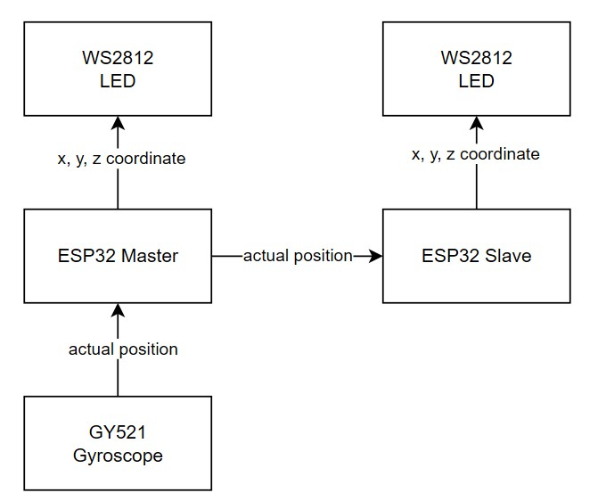

# ESPNow Master-Slave Code Example
I made a project a while ago that required me to **configure several ESPs without using Bluetooth or wired connectivity**. I chose to use **ESPNow** because it is very simple. I want to share with you how to do that. Hopefully, it'll help you if you need to use it in your project.

This repository provides example code demonstrating how to implement the **ESPNow protocol** for communication between **two ESP32 devices in a master-slave configuration**.

## Introduction

ESPNow is a wireless communication protocol developed by Espressif that allows multiple devices to communicate with each other directly without the need for a Wi-Fi network. It operates in the 2.4 GHz frequency band and uses the same physical layer as Wi-Fi but without the overhead of a Wi-Fi stack, making it lightweight and efficient.

### Key Features of ESPNow

- **Connectionless**: Devices do not need to establish a connection before exchanging data.
- **Low Latency**: Data packets are transmitted almost immediately.
- **Broadcast Capability**: One device can broadcast data to multiple peer devices simultaneously.
- **Low Power Consumption**: Suitable for battery-powered applications.

### Pros and Cons Compared to Bluetooth and Wi-Fi

#### Pros
- **Low Latency**: Unlike Wi-Fi, which requires connection setup and can introduce latency, ESPNow transmits data almost instantly.
- **Power Efficiency**: ESPNow is more power-efficient than Wi-Fi, making it ideal for battery-powered devices.
- **Simplicity**: The connectionless nature of ESPNow simplifies the communication process compared to Bluetooth and Wi-Fi.
- **Broadcasting**: ESPNow supports broadcasting to multiple devices simultaneously, which is not as straightforward with Bluetooth.

#### Cons
- **Range**: The range of ESPNow is generally shorter than Wi-Fi.
- **Throughput**: The data rate of ESPNow is lower compared to Wi-Fi and Bluetooth, making it less suitable for high-bandwidth applications.
- **Compatibility**: ESPNow is specific to Espressif chips (like ESP32), limiting its use to these devices.
- **Security**: While ESPNow can use encryption, it does not have as robust security features as standard Wi-Fi protocols.

## Project Structure

- `esp_master/` - Contains the code for the ESP32 master device.
- `esp_slave/` - Contains the code for the ESP32 slave device.

## Components

- Two ESP32 modules
- WS2812 LED (for visual indication)
- GY521 Gyroscope (for reading sensor data)

## Connection Diagram

<div style="text-align: center;">
    
</div>

## Getting Started

### Prerequisites

- Arduino IDE or PlatformIO installed
- ESP32 board support added to the IDE

### Installation

1. Clone this repository to your local machine:
    ```sh
    git clone https://github.com/tirta-ir/iot-espnow-example.git
    ```

2. Open the `esp_master` and `esp_slave` folders separately in your IDE.

### Setup

#### Master Device

1. Open the `esp_master.ino` file.
2. Ensure the necessary libraries are included:
    ```cpp
    #include <esp_now.h>
    #include <WiFi.h>
    #include <MPU6050.h>
    #include <FastLED.h>
    ```
3. Upload the code to your first ESP32 device.

#### Slave Device

1. Open the `esp_slave.ino` file.
2. Ensure the necessary libraries are included:
    ```cpp
    #include <esp_now.h>
    #include <WiFi.h>
    #include <FastLED.h>
    ```
3. Upload the code to your second ESP32 device.

### Usage

1. Power on both ESP32 devices.
2. The master device will scan for the slave device and establish a connection using ESPNow.
3. The master device will read data from the gyro sensor and send it to the slave device.
4. Both devices will control their respective WS2812 LED strips based on the received data.

### Troubleshooting

- Ensure both ESP32 devices are powered on and within range.
- Check serial output for debugging information.
- Verify that the correct MAC addresses are used for pairing devices.


## License

This project is licensed under the MIT License - see the [LICENSE](LICENSE) file for details.
